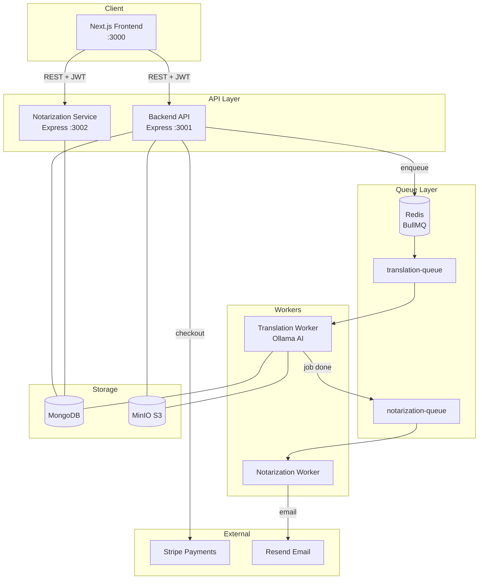
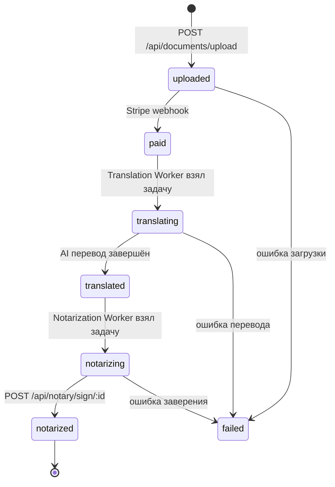

# Translation & Notarization Platform

[](https://github.com/your-org/translation-notarization/actions/workflows/ci.yml)


Платформа для профессионального перевода документов с нотариальным заверением. Пользователь загружает документ, оплачивает перевод, AI-воркер переводит, нотариус заверяет — всё в одном потоке.

---

## Архитектура



---

## Flow документа



---

## Стек технологий

| Слой | Технология |
|---|---|
| Frontend | Next.js 14, React 18, TypeScript, TailwindCSS |
| Backend API | Node.js 20, Express.js, JWT, Multer |
| Notarization | Node.js 20, Express.js, BullMQ, Resend |
| Workers | Node.js 20, BullMQ, Ollama (AI перевод) |
| База данных | MongoDB 7 (Mongoose) |
| Очередь задач | Redis 7 + BullMQ |
| Файловое хранилище | MinIO (S3-совместимый) |
| Платежи | Stripe |
| Email | Resend |
| Контейнеризация | Docker, docker compose |
| Оркестрация | Kubernetes + NGINX Ingress + HPA |
| CI/CD | GitHub Actions |

---

## Быстрый старт (локально)

### Требования

- Node.js 20+
- Docker & Docker Compose
- Git

### 1. Клонировать репозиторий

```bash
git clone https://github.com/your-org/translation-notarization.git
cd translation-notarization
```

### 2. Запустить инфраструктуру

```bash
docker compose up -d
```

Поднимет MongoDB (27017), Redis (6379), MinIO (9000/9001).

### 3. Настроить переменные окружения

Скопируй `.env.example` в каждом сервисе:

```bash
for dir in backend workers notarization frontend; do
  cp $dir/.env.example $dir/.env 2>/dev/null || echo "$dir: нет .env.example"
done
```

Минимум для запуска (`backend/.env`):

```env
MONGODB_URI=mongodb://localhost:27017/translation-notarization
REDIS_URL=redis://localhost:6379
JWT_SECRET=your-secret-here
MINIO_ENDPOINT=localhost
MINIO_ACCESS_KEY=minioadmin
MINIO_SECRET_KEY=minioadmin
STRIPE_SECRET_KEY=sk_test_...
PORT=3001
```

### 4. Установить зависимости и запустить

```bash
# Backend API
cd backend && npm install && npm run dev &

# Translation Workers
cd ../workers && npm install && npm run dev &

# Notarization Service
cd ../notarization && npm install && npm run dev &

# Frontend
cd ../frontend && npm install && npm run dev
```

### 5. Проверить сервисы

```bash
curl http://localhost:3001/health  # Backend
curl http://localhost:3002/health  # Notarization
open http://localhost:3000          # Frontend
open http://localhost:9001          # MinIO Console (minioadmin/minioadmin)
```

---

## Деплой в Kubernetes

### Требования

- kubectl настроен на кластер
- Ingress NGINX controller установлен
- Образы Docker опубликованы в registry

### 1. Создать namespace

```bash
kubectl apply -f k8s/namespace.yaml
```

### 2. Создать секреты

Отредактируй `k8s/secrets.yaml` (base64-encoded значения) и примени:

```bash
# Закодировать значение:
echo -n "your-secret" | base64

kubectl apply -f k8s/secrets.yaml
```

### 3. Задеплоить хранилища

```bash
kubectl apply -f k8s/mongodb.yaml
kubectl apply -f k8s/redis.yaml
kubectl apply -f k8s/minio.yaml
```

### 4. Задеплоить сервисы

```bash
kubectl apply -f k8s/backend.yaml
kubectl apply -f k8s/workers.yaml
kubectl apply -f k8s/notarization.yaml
```

### 5. Настроить Ingress и автоскейлинг

```bash
kubectl apply -f k8s/ingress.yaml
kubectl apply -f k8s/hpa.yaml
```

### 6. Проверить статус

```bash
kubectl get pods -n translation-notarization
kubectl get ingress -n translation-notarization
```

---

## Структура проекта

```
translation-notarization/
├── backend/          # Express API (auth, documents, payments, notary routes)
├── frontend/         # Next.js UI (upload, dashboard, notary cabinet)
├── workers/          # BullMQ workers (AI translation via Ollama)
├── notarization/     # Notarization service (sign flow, email to notary)
├── tests/            # Playwright E2E тесты
├── k8s/              # Kubernetes манифесты
├── docs/             # Архитектурная документация
└── docker-compose.yml
```

---

## Документация

- [Архитектура сервисов](docs/ARCHITECTURE.md)

---

## Лицензия

MIT
